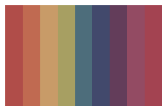
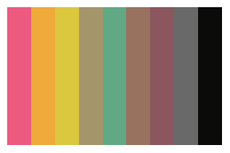

popthemes
================

# 

<!-- badges: start -->

[](https://github.com/johnmackintosh/popthemes/actions/workflows/R-CMD-check.yaml)

<!-- badges: end -->

## What?

This is a collection of colour palettes based (mainly) on pop album
covers.

Featuring:

-   Aqua
-   Bangles
-   Beck
-   Betty Boo
-   B\*Witched
-   Deee Lite
-   Hole
-   No Doubt
-   Rick Astley
-   S Club 7
-   Spice Girls
-   Steps

## Why?

Because [I’ve done
Metallica](https://github.com/johnmackintosh/metallicaRt) and [classic
rock](https://github.com/johnmackintosh/rockthemes).

The rockthemes has some pop acts featured in it as well, including No
Doubt and DeeeLite. They’re included here - and the palettes have been
tweaked slightly.

## Installation

This won’t be appearing on CRAN, so please install using the remotes
package.

``` r
#library(remotes)
#remotes::install_github("johnmackintosh/popthemes")
library(popthemes)
library(ggplot2)
library(dplyr)
library(scales)
library(gapminder)
```

# Palettes

``` r
pop_palette("aqua")
pop_palette("bangles")
pop_palette("beck")
```


``` r
pop_palette("boo")
pop_palette("bwitched")
pop_palette("deeelite")
```



``` r
pop_palette("hole")
pop_palette("nodoubt")
pop_palette("rickroll")
```



``` r
pop_palette("sclub7")
pop_palette("spice")
pop_palette("steps")
```


## ggplot2 use

Colour and fills for ggplot2.


## Credit

[Thanks to Ryo for the tvthemes
package](https://github.com/Ryo-N7/tvthemes) which helped me get this
off the ground quickly
