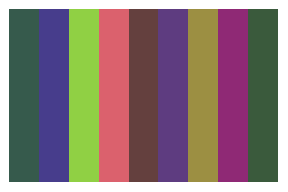

popthemes
================

<!-- badges: start -->

[](https://github.com/johnmackintosh/popthemes/actions/workflows/R-CMD-check.yaml)

<!-- badges: end -->

## What?

This is a collection of colour palettes based on 90s pop album covers.

Some of these appeared frequently in web searches, so they must be good.

Featuring:

-   Aqua
-   Bangles
-   Beck
-   Betty Boo
-   Breeders
-   B\*Witched
-   Deee Lite
-   Hole
-   No Doubt
-   S Club 7
-   Spice Girls
-   Steps

## Why?

Because[I’ve done
Metallica](https://github.com/johnmackintosh/metallicaRt) and [classic
rock](https://github.com/johnmackintosh/rockthemes).

Although rockthemes has some pop acts in it as well, including No Doubt
and DeeeLite, who also appear here. Don’t worry about it.

## Installation

This will probably not go to CRAN, so please install using the remotes
package.

``` r
#library(remotes)
#remotes::install_github("johnmackintosh/popthemes")
library(popthemes)
```

# Palettes

``` r
pop_palette("aqua")
pop_palette("bangles")
pop_palette("beck")
```


``` r
pop_palette("boo")
pop_palette("breeders")
pop_palette("bwitched")
```



``` r
pop_palette("deeelite")
pop_palette("hole")
pop_palette("nodoubt")
```


``` r
pop_palette("sclub7")
pop_palette("spice")
pop_palette("steps")
```


## Credit

[Thanks to Ryo for the tvthemes
package](https://github.com/Ryo-N7/tvthemes) which helped me get this
off the ground quickly

## Code of Conduct

Please note that the popthemes project is released with a [Contributor
Code of Conduct](CODE_OF_CONDUCT.md). By contributing to this project
you agree to abide by its terms.

## Contributing

See the [Contribution guide](.github/CONTRIBUTING.md)
